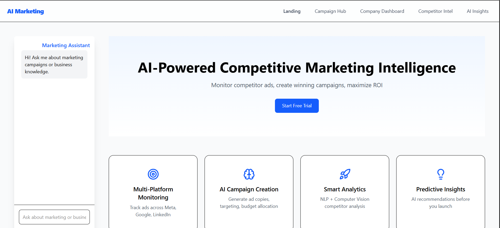
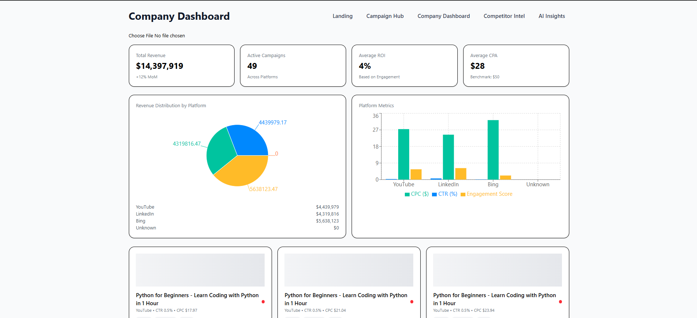
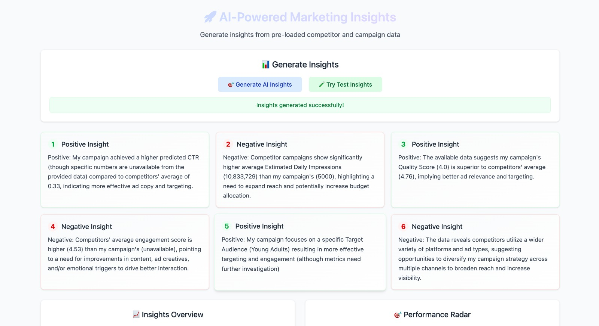

# Elite

Welcome to the AI-Powered Marketing Intelligence Platform! This full-stack application provides competitive ad analysis, AI-driven campaign generation, and predictive insights to help you maximize your marketing ROI.

## ✨ Features

*   **Multi-Platform Ad Monitoring**: Track competitor advertisements across various platforms.
*   **AI-Powered Campaign Generation**: Automatically create ad copy, define target audiences, and suggest budget allocations.
*   **Smart Analytics**: Leverage NLP and Computer Vision for in-depth analysis of competitor strategies.
*   **Predictive Insights**: Receive AI-driven recommendations to optimize your campaigns before they launch.
*   **Interactive AI Assistant**: Chat with a marketing expert chatbot for instant business and marketing knowledge.
*   **User Authentication**: Secure registration and login functionality for users.

## 📸 Screenshots

| Landing Page                                  | Dashboard                                     | Insights View                               |
| --------------------------------------------- | --------------------------------------------- | ------------------------------------------- |
|  |  |  |

## 🛠️ Tech Stack

*   **Frontend**: React, Vite, Tailwind CSS, GSAP, Lucide React
*   **Backend**: Python, Flask (for Authentication), FastAPI (for AI Insights)
*   **AI/ML**: Google Gemini, Pandas, NLTK, spaCy, Transformers
*   **Database**: SQLite

## 📋 Prerequisites

Before you begin, ensure you have the following installed on your system:

*   [Node.js](https://nodejs.org/) (v18 or later)
*   [Python](https://www.python.org/) (v3.9 or later) and `pip`
*   [Tesseract-OCR](https://github.com/UB-Mannheim/tesseract/wiki): Required for OCR tasks. Make sure to add it to your system's PATH.
*   **WebDriver**: A browser-specific WebDriver (e.g., [ChromeDriver](https://googlechromelabs.github.io/chrome-for-testing/)) for Selenium. Ensure it's in your system's PATH.

## 🚀 Getting Started

Follow these steps to get your development environment set up and running.

### 1. Clone the Repository

```sh
git clone <https://github.com/GDGVITM/hackbuild-Elite.git>
cd hackbuild-Elite
```

### 2. Environment Variables

You need to create two `.env` files for the project to work correctly.

*   **Root Directory (`.env`)**: For the Vite frontend.
    ```
    VITE_GEMINI_API_KEY=your_google_gemini_api_key
    ```
*   **Backend Directory (`backend/.env`)**: For the FastAPI/Gemini backend.
    ```
    GEMINI_API_KEY=your_google_gemini_api_key
    ```

### 3. Backend Setup

The backend consists of two services: a Flask app for authentication and a FastAPI app for AI insights.

```sh
# Navigate to the backend directory
cd backend

# Create and activate a virtual environment (recommended)
python -m venv venv
source venv/bin/activate  # On Windows, use `venv\Scripts\activate`

# Install the required Python packages
pip install -r requirements.txt

# Perform one-time setup for NLTK and spaCy
python -m spacy download en_core_web_sm
python -c "import nltk; nltk.download('punkt'); nltk.download('stopwords'); nltk.download('vader_lexicon');"
```

### 4. Frontend Setup

Open a new terminal and navigate to the project's root directory.

```sh
# (From the root directory)
npm install
```

## 🏃‍♂️ Running the Application
### 1. Start the AI Insights Backend (FastAPI)

In your second terminal:

```sh
# In the project's root directory
python insight_gen.py
# The FastAPI server will start, typically on http://localhost:8000
```

### 2. Start the Frontend (Vite)

In your third terminal:

```sh
# In the project's root directory
npm run dev
# Your React application will be available at http://localhost:5173
```
You can now open your browser and navigate to `http://localhost:5173` to use the application.
